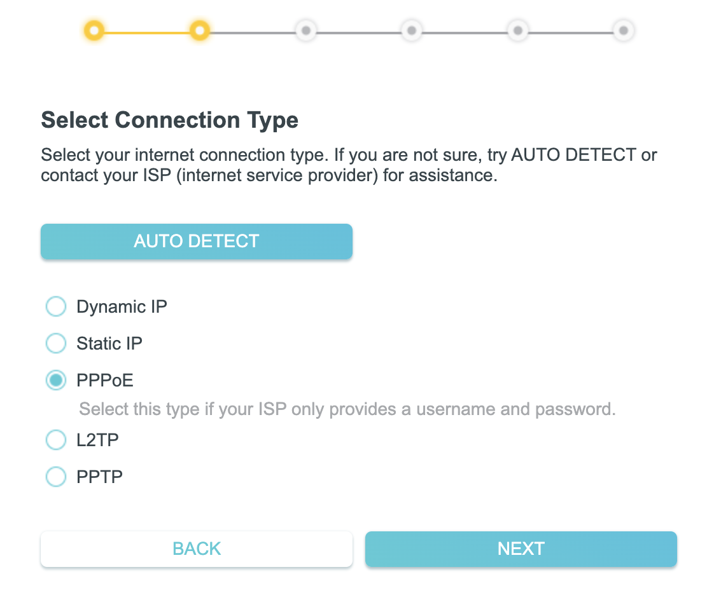
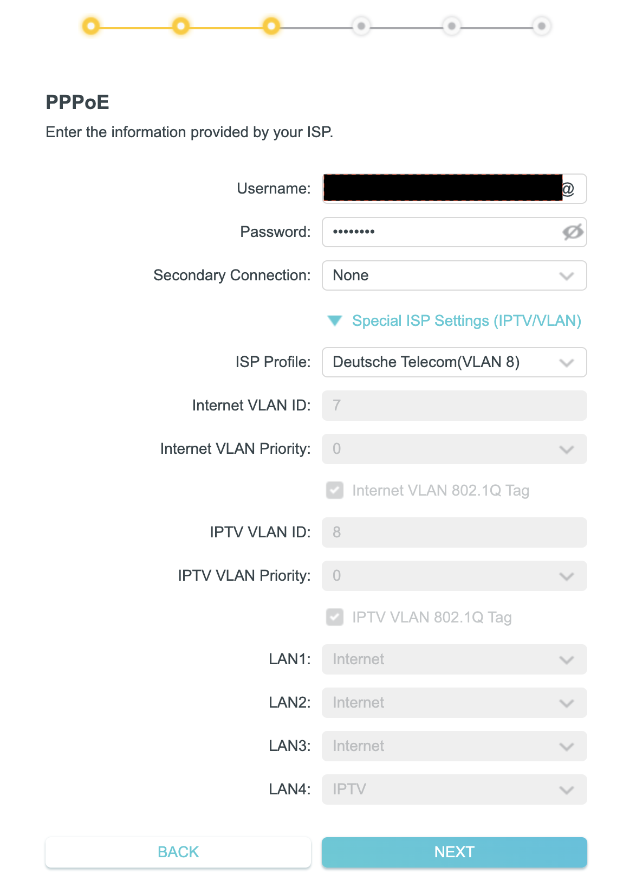

# Germany telekom install internet for your router

I use my tp-link router Archer C80

## Select connection type

You will need to select the PPPoE connection type

## Provide username and password

Template of username is: `<Anschlusskennung><Zugangsnummer><Mitbenutzernummer>@t-online.de`
NOTE: symbols `<`, `>` do not need to add

Template password: `Persönliche Kennwort`

You can find `Anschlusskennung`, `Zugangsnummer`, `Mitbenutzernummer`, and
`Persönliche Kennwort` in your contract

## Additional settings [for me it was a game changer]

I had to select the special ISP Settings (IPTV/VLAN) with a profile for Telekom

